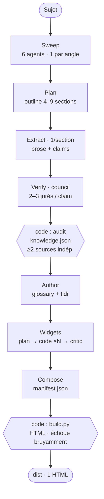

# scriptorium

Fabrique de documents multi-thèmes. Chaque thème est transformé en une **monographie**
partageant une charte graphique commune.

Un document unique : abstract, sections vérifiées, widgets démonstratifs, exercices, biblio, pointeurs, glossaire.

## Structure

```
themes/<slug>/            un dossier par thème (slug kebab-case, sans accents)
  knowledge.json          base de faits vérifiée (source de vérité)
  glossary.json · tldr.json
  widgets/                widgets interactifs du thème
  manifest.json           manifeste-vue du document
  dist/                   le HTML généré
.claude/skills/monograph/        le skill local qui produit une monographie (charte + build.py partagés)
.claude/skills/frugalmonograph/  variante à coût réduit (mêmes garanties)
.claude/skills/leanmonograph/    variante « vérifier d'abord, écrire une fois » (+ lint déterministe)
```

## Produire une monographie

Dans Claude Code, invoque le skill local avec un sujet (d'une phrase à une page) :

```
/monograph <sujet>
```

Le skill effectue une recherche approfondie, vérifie chaque fait contre **≥ 2 sources
indépendantes** (passe adversariale/council), construit la base de faits, puis assemble
le document de façon déterministe. Le modèle juge ; le code assemble.

**Variante à coût réduit :**

```
/frugalmonograph <sujet>
```

Même produit et **mêmes garanties non négociables** (≥ 2 sources indépendantes ; `build.py`
échoue bruyamment) ; seul le profil de coût change : modèles moins chers (Sonnet) sur la
recherche/vérification, council ramené à **2 jurés** dans tous les cas, et des plafonds
(`MAX_SECTIONS=9`, `MAX_CLAIMS_PER_SECTION=4`). Le jugement structurant (Plan, Author, Widgets,
Compose) reste sur Opus. Pour comparer les deux variantes sur un même sujet, utilise un slug
distinct (ex. `bloom-filters-frugal`).

**Variante « vérifier d'abord, écrire une fois » :**

```
/leanmonograph <sujet>
```

Même produit et mêmes garanties, avec deux renversements d'architecture : le **council audite
par section** (2 jurés adversariaux sur tous les claims d'une section, fetchs amortis, + 1 juré
dédié par claim « contestable ») et la **prose est rédigée après l'audit** par un auteur unique
(charte de voix, fil rouge, relecture de continuité) — la dérive « prose pré-council » disparaît
par construction. Un **lint déterministe** (`scripts/lint.py`) traque les pivots des claims
rejetés et les chiffres absents de `knowledge.json`, vérifiés à la source avant l'assemblage.
Cible : moins de tokens que `/frugalmonograph` et une prose plus homogène (en cours de
validation comparative).

> [!WARNING]
> `/monograph` consomme **ÉNORMÉMENT de tokens** — de l'ordre de **plusieurs millions de
> tokens de sortie par monographie** (runs observés : ~5 M chacun). Le coût est dominé par le
> fan-out massif des phases **Verify** (council adversarial : 2–3 jurés × tous les claims de
> toutes les sections) et **Widgets** (codage + relecture de HTML interactif). À lancer en
> connaissance de cause — mais un run interrompu (rate-limit) se **reprend sans re-payer le
> travail déjà fait** (voir « Reprise après interruption »).

### Reprise après interruption

Le fan-out massif se fait régulièrement **rate-limiter côté serveur**. Plutôt que de relancer un
run frais (qui re-paie tout), le workflow écrit des **checkpoints incrémentaux** dans
`themes/<slug>/.monograph/` au fil de l'eau : la recherche après *Plan*, **une fois par section
auditée** pendant *Verify*, et les widgets après leur phase. Relancer avec **`args.resume = true`**
(mêmes `subject`/`slug`/`themeDir`) reprend là où ça s'est arrêté : *Sweep*/*Plan* sont sautés,
**seules les sections sans checkpoint sont re-vérifiées**, les widgets déjà faits sont sautés. Ces
checkpoints survivent à un `/clear` ou à un changement de session (ce que le cache de reprise du
moteur, lui, ne garantit pas). Un run **frais** (sans `resume`) ignore et réécrit les checkpoints.
Détail dans le `SKILL.md` du skill ; le câblage est couvert par `scripts/test_resume.mjs`.

### Le pipeline multi-agents

En coulisse, `/monograph` lance un **workflow multi-agents** en 8 phases. La frontière est
nette : **le modèle juge** (cherche, rédige, vérifie, sélectionne) et **le code assemble** de
façon déterministe. Le fan-out est massif sur **Verify** (le council) et **Widgets**.

1. **Sweep** — 6 agents en parallèle, un par angle (fondations, théorie, variantes,
   applications, idées reçues, écosystème) ; chacun cherche sur le web et remonte des sources
   et des faits sourcés (URL exactes, jamais inventées).
2. **Plan** — 1 agent conçoit l'outline (4–9 sections) à partir des findings agrégés.
3. **Extract** — 1 agent par section (en pipeline) : rédige la prose et propose 2–4 claims
   vérifiables, dont au moins un « contestable » (idée reçue à départager).
4. **Verify** — *council adversarial* : chaque claim passe devant 2 jurés (s'il est « établi »)
   ou 3 (s'il est « contestable »), sous trois lentilles — réfutation, indépendance des sources,
   source primaire. Puis, **en code** : la décision d'audit (`confirmed` = tenu par ≥ 2 jurés
   **et** ≥ 2 sources indépendantes ; sinon `corrected`, sinon `rejected`), l'assemblage de
   `knowledge.json` et l'élagage des sections sans matière vérifiée.
5. **Author** — 1 agent écrit `glossary.json` et `tldr.json` à partir des faits vérifiés.
6. **Widgets** — 2ᵉ fan-out : un *planner* choisit les mécanismes non triviaux qui gagnent à
   être *montrés*, des *codeurs* écrivent chacun un widget HTML interactif autonome, un *critic*
   les relit (une re-passe de correction possible).

   Au-delà des **sondes** (un widget par mécanisme), une monographie peut porter un ou plusieurs
   **super-widgets synoptiques** : la visualisation d'un **processus de bout en bout** (ex. backprop :
   passe avant → rétropropagation → itérations jusqu'à convergence) sur un réseau jouet. On peut aussi
   les ajouter après coup à un article existant (`args.superwidgetOnly`).

   Quand une illustration **fixe** vaut mieux qu'une interaction (une courbe, un organigramme, un
   schéma), le pipeline insère une **figure statique** au fil du texte, légendée et numérotée
   « Figure N » — choisie par le même planificateur visuel, sans surcharger.

7. **Compose** — 1 agent écrit `manifest.json`, le *layout* best-of (abstract → sections +
   widgets → exercices → biblio → pointeurs → glossaire).
8. **Build** — `build.py` assemble le HTML final de façon déterministe et **échoue bruyamment**
   (référence manquante, balise déséquilibrée, jeton non substitué…).



## Thèmes

Chaque document est sous `themes/<slug>/dist/`. Le corpus compte **40 thèmes** (42 documents),
tous générés par `/monograph` ou `/frugalmonograph` — sauf **automatic-prompt-optimization**,
construit à la main avant le skill et conservé gelé sous
`themes/automatic-prompt-optimization/legacy/`. La liste complète, groupée par domaine
(`tools/taxonomy.json`, skill `/arrange`), est publiée sur la
[home GitHub Pages](https://sandjab.github.io/scriptorium/) régénérée à chaque push par
`tools/build_site.py`.

## Statut

- Phase 0 — restructure & migration : ✅
- Phase 1 — générateur déterministe (`.claude/skills/monograph/` : charte + `build.py`, 16 tests) : ✅
- Phase 2 — workflow multi-agents + `SKILL.md` des skills `monograph` et `frugalmonograph` : ✅
  Pipeline à **8 phases** (Sweep → Plan → Extract → Verify → Author → **Widgets** → Compose →
  Build), document unique « best-of » + widgets pilotés par concept. Éprouvé sur **39 thèmes**
  hors APO et publié via GitHub Pages.
- Skill `leanmonograph` (« vérifier d'abord, écrire une fois » + lint déterministe) : construit
  et revu ; **pas encore éprouvé en réel** — validation comparative à venir sur un thème.

## Licence

Code sous licence MIT — voir [`LICENSE`](LICENSE).
