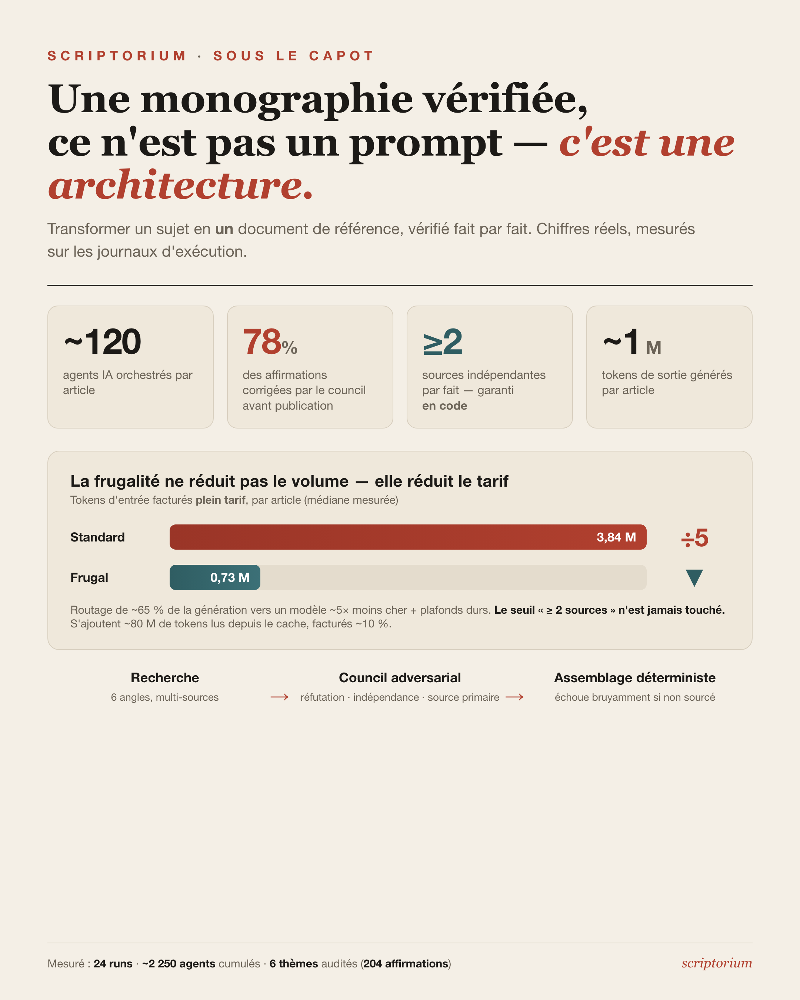

# Posts LinkedIn — les skills de génération de monographie (`/monograph` & `/frugalmonograph`)

> Trois versions prêtes à publier (court / retex / analyse), même fond, audiences différentes.
> Tous les chiffres sont **mesurés** sur les journaux d'exécution des workflows
> (`~/.claude/projects/.../subagents/workflows/wf_*/agent-*.jsonl`) et les `audit-report.json`
> des thèmes — rien n'est estimé.

## Visuel associé

## Chiffres de référence (médianes par article, mesurées)

| Type de token (par article) | monograph (Opus) | frugal (Opus+Sonnet) |
|---|---:|---:|
| **Entrée fraîche** (plein tarif) | 3,84 M | **0,73 M** |
| Création de cache (~1,25×) | 14,8 M | 11,1 M |
| Lecture de cache (~0,1×) | 48,1 M | 79,9 M |
| **→ Entrée totale** | 75,0 M | 91,4 M |
| **Sortie** | 0,56 M | 0,93 M |
| **Agents / article** | 61–242 (méd. 127) | 103–130 (méd. 118) |
| Temps brut (rate-limit inclus) | 16–474 min | 109–309 min |

- **Signal qualité** : sur 6 thèmes récents, **159 affirmations sur 204 (78 %) corrigées** par le council avant publication.
- **Cumul projet** : 24 runs, **~2 250 agents**, **12,6 M tokens de sortie**.

## Coût estimé — à titre indicatif (tarifs API publics)

Aux prix catalogue de l'API (Opus 4.8 : 5/25 $ le M de tokens entrée/sortie ; Sonnet 4.6 : 3/15 $ ;
**cache écrit ×1,25, lu ×0,1** — vérifié : 100 % du cache est en TTL 5 min), coût **médian mesuré** par article :

| Profil | Coût / article (USD) | Coût / article (EUR ~0,90 €/$) |
|---|---:|---:|
| **Standard** (Opus partout) | ≈ 161 $ | **≈ 145 €** |
| **Frugal** (Opus + Sonnet) | ≈ 100 $ | **≈ 90 €** (−38 %) |

> ⚠️ **Coûts notionnels, pas une facture.** La fabrique tourne sous **forfait Claude Max ×20**
> (abonnement mensuel fixe) : le **coût marginal réel par article est ~nul** au-delà de l'abonnement.
> Ces euros mesurent ce que paierait **un tiers facturé à l'usage** — un repère de *valeur*, pas une
> dépense engagée. (Conversion ~0,90 €/$, taux indicatif.)
- **Garde-fous honnêteté** : l'entrée totale (~75–90 M) est dominée à ~90 % par de la lecture de cache (facturée ~10 %) ; le temps brut est dominé par les rate-limits serveur, pas le calcul ; le frugal ne réduit pas le *volume* de tokens mais déplace ~65 % de la génération vers un modèle ~5× moins cher.

---

## Version 1 — Court & punchy (~160 mots)

J'ai lancé **~2 250 agents IA** pour écrire une poignée d'articles techniques. Voici pourquoi.

Pour chaque sujet (filtres de Bloom, modèles de diffusion, hachage parfait…), un *seul* document HTML de référence, vérifié. Sous le capot : **~120 agents par article**, une recherche multi-angles, puis un **« council » adversarial** qui attaque chaque affirmation sous 2-3 angles (réfutation, indépendance des sources, source primaire).

Le chiffre qui m'a scotché : sur **204 affirmations vérifiées, 78 % ont été corrigées** avant publication. 78 % que n'importe quel *« génère-moi un article sur X »* aurait publiées telles quelles — fausses ou imprécises.

Coût par article : **~0,7 M de tokens d'entrée + ~1 M de sortie** (plein tarif), plus ~80 M servis par le cache à 10 % du prix. Et 1 à 3 h, surtout à attendre les rate-limits 😅.

La rigueur factuelle n'est pas un prompt. C'est une architecture.

Détails en commentaire 👇

\#IA #LLM #IngénierieLogicielle

---

## Version 2 — Retex perso, pairs IA (~320 mots)

**Ce que ça coûte vraiment de faire dire la vérité à un LLM.**

Depuis quelques semaines je construis *scriptorium* : une fabrique qui transforme un sujet (« les filtres de Bloom », « les modèles de diffusion »…) en **un seul** document HTML de référence, vérifié, avec des widgets interactifs qui *montrent* le mécanisme au lieu de le décrire.

J'ai deux skills jumeaux : `/monograph` et sa variante `/frugalmonograph`. Même pipeline, même garantie non négociable — **tout fait « confirmé » s'appuie sur ≥ 2 sources indépendantes, vérifié en *code*, pas par bonne volonté du modèle.**

Les chiffres réels (extraits des logs, pas estimés) :

→ **~120 agents** par article (jusqu'à 240 sur les gros sujets)
→ **~0,7 M de tokens d'entrée + ~1 M de sortie** par article, plein tarif — plus **~80 M lus depuis le cache** (facturés ~10 %). La version non frugale grimpe à **~3,8 M d'entrée** plein tarif.
→ **1 à 3 h** — dont l'essentiel à encaisser les rate-limits serveur, pas à calculer
→ **159 affirmations sur 204 (78 %) corrigées** par le council avant publication

Ce dernier chiffre est le cœur du truc. Un simple *« génère-moi un playground sur X »* produit quelque chose de joli et **plausible** — mais ces 78 % d'imprécisions partent en ligne sans filet. Un *deep research* standard cite ses sources, mais rend de la prose à lire, pas un artefact interactif dont le build **échoue bruyamment** si une affirmation n'est pas sourcée.

La variante frugale ? Contre-intuitif : elle ne consomme pas *moins* de tokens. Elle bascule **~65 % de la génération sur Sonnet** (~5× moins cher), **divise par 5 l'entrée plein tarif** et **borne le fan-out** par des plafonds durs. Mêmes garanties, fraction du coût.

Ma leçon : la fiabilité factuelle d'un LLM n'est pas une affaire de prompt. C'est une **architecture** — recherche, contradiction, vérification, assemblage déterministe.

\#LLM #IA #Agents #IngénierieLogicielle #RAG

---

## Version 3 — Analyse détaillée, dirigeants ESN (~640 mots)

**Faire produire à un LLM un document de référence *fiable* : une affaire d'architecture, pas de prompt.**

Le débat « l'IA va-t-elle écrire notre doc technique ? » manque souvent l'essentiel. La vraie question n'est pas *« sait-elle écrire ? »* — oui, vite et bien — mais *« peut-on lui faire confiance sur les faits ? »*. J'ai voulu y répondre par l'ingénierie plutôt que par l'incantation.

**La genèse.** Le projet est né d'un document fait main (un triptyque sur l'optimisation de prompts), que j'ai voulu généraliser : transformer *n'importe quel* sujet en **un** document HTML « best-of » — un seul, le plus complet — avec une exigence non négociable : **toute affirmation « confirmée » doit s'appuyer sur au moins 2 sources indépendantes, contrôlées en *code***.

**L'architecture.** Deux skills jumeaux, `/monograph` et `/frugalmonograph`, orchestrent un workflow multi-agents :

1. **Recherche** multi-angles (fondements, théorie, variantes, applications, idées reçues, écosystème) ;
2. **Extraction** des affirmations candidates ;
3. **Council adversarial** — chaque affirmation est attaquée par 2 à 3 « jurés » sous des angles distincts : réfutation, indépendance des sources, source primaire ;
4. **Rédaction** des faits validés ;
5. **Widgets interactifs** (codés puis relus par un critique) ;
6. **Assemblage déterministe** : le code assemble, et **échoue bruyamment** si une référence manque ou si une affirmation n'est pas sourcée.

La frontière est nette : **le modèle juge, le code assemble.** Aucune logique d'édition cachée.

**Les chiffres réels** (extraits des journaux d'exécution, pas estimés) :

- **~120 agents IA** lancés par article (jusqu'à 240 sur les sujets les plus larges) ;
- **Côté tokens, par article** : ~0,7 M en **entrée plein tarif** + ~1 M en **sortie**, auxquels s'ajoutent **~80 M de tokens lus depuis le cache** (facturés ~10 % du prix). L'entrée *totale* atteint donc ~90 M — chiffre réel mais trompeur, car ~90 % est du cache bon marché ;
- **1 à 3 heures** de génération — dominé, en toute transparence, par l'attente des limitations de débit serveur, pas par le calcul ;
- **159 affirmations sur 204 (78 %) corrigées** par le council avant publication, sur les 6 derniers thèmes.

Ce dernier chiffre est, pour un décideur, le plus parlant. **78 % du premier jet était imprécis ou faux.** C'est exactement ce qu'un outil grand public — *« génère-moi un playground interactif sur X »* — publierait sans filet : un rendu convaincant, soigné… et factuellement non garanti. Un *deep research* classique fait mieux (il cite), mais rend de la **prose à lire**, sans artefact interactif ni build qui refuse les affirmations non sourcées. Ici, la vérification est **adversariale, multi-passes et opposable** : chaque article garde sa piste d'audit, affirmation par affirmation.

**La frugalité, sans compromis sur la rigueur.** La variante frugale n'économise pas en *réduisant* la matière. Elle déplace **~65 % de la génération vers un modèle ~5× moins cher** (Sonnet pour la recherche et la vérification ; le modèle haut de gamme réservé au jugement structurant), **divise par ~5 l'entrée facturée plein tarif** (de ~3,8 M à ~0,7 M par article) et **borne le fan-out** par des plafonds durs. Le seuil « ≥ 2 sources » n'est **jamais** touché.

**Avantages / limites, sans langue de bois.**
✅ Fiabilité factuelle vérifiable et opposable ; livrable unique, interactif, reproductible.
⚠️ Ce n'est ni instantané ni gratuit (~1 M tokens de sortie, 100+ agents, 1-3 h) ; opérationnellement complexe (reprises sur rate-limit) ; surdimensionné pour un sujet trivial.

**La leçon pour une ESN.** La valeur n'est pas dans le prompt magique, mais dans le **harnais** autour du modèle : contradiction, vérification croisée, assemblage déterministe. C'est précisément là que se joue la différence entre une démo impressionnante et un livrable sur lequel on engage sa signature.

\#IA #LLM #ESN #Conseil #IngénierieLogicielle #Agents
